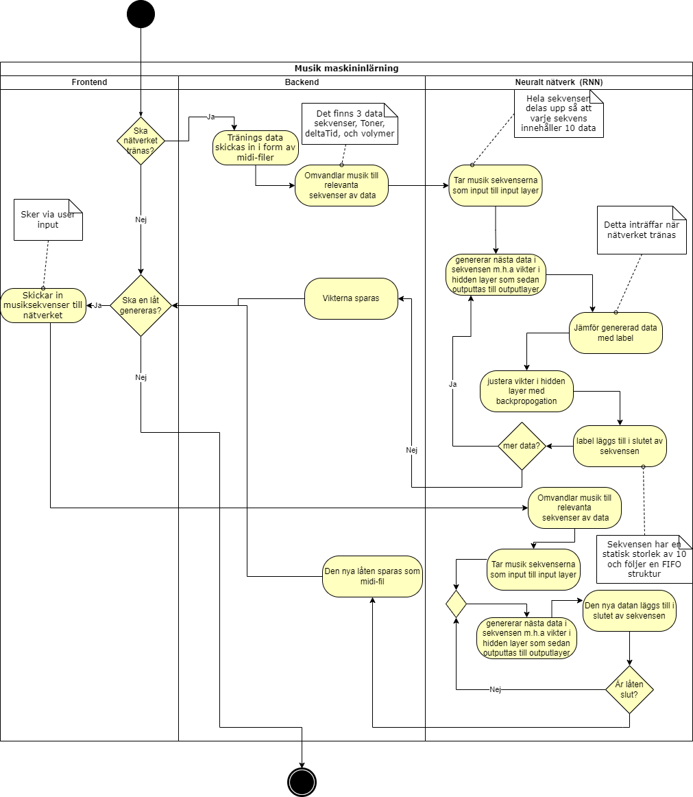

A project that uses AI for generating a song based on inputted tunes. Written in JS and Rust.

A project that uses AI for generating a song based on inputted tunes. Written in JS and Rust.

TODO when adding a feature/fixing a bug:
- Create an issue
- Assign a person, set a milestone and labels as well as the project board
- Go to the project board and move the card from Todo to In Progress
- Create a branch (feature/feature_name or bug/bug_name)
- Create a pr request
- Let someone else in the group review it and merge it
- Move the card in the project board to completed 

[Issue Board](https://github.com/INDAPlus21/danteac-eliased-faysalbm-melg-project/projects/2)

We will devide the project according to the [milestones](https://github.com/INDAPlus21/danteac-eliased-faysalbm-melg-project/milestones)

## Installation instructions

Requires NodeJS (LTS not latest), Js, npm and Rust

Run the following commands:
- cargo install wasm-pack
- npm install
- wasm-pack build
- .\node_modules.bin\webpack
- cd dist
- ..\node_modules.bin\wasm-server

This starts the front-end wasm server

## Activity Diagram

Decribes the overall flow of the program. May change in the future. (Requires basic knowledge of swedish).

