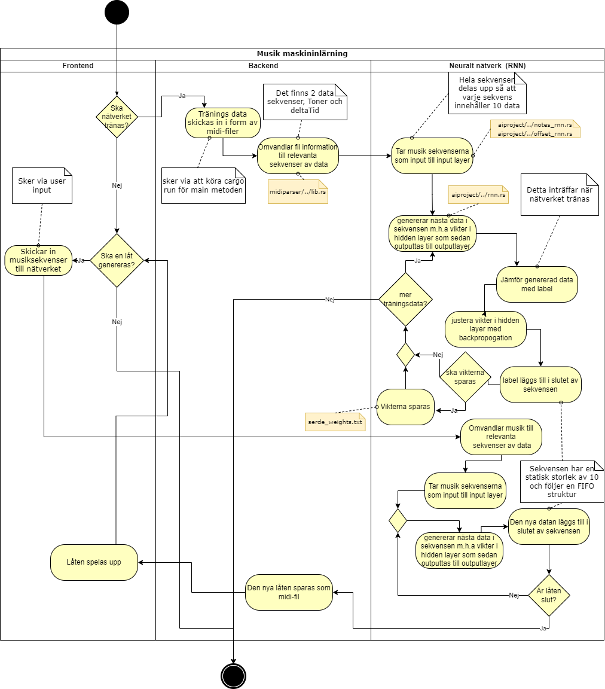

A project that uses AI for generating a song based on inputted tunes. Written in JS and Rust.

To serve the project set up a local http-server in the front-end folder. You also need to compile the wasm in the integrated_rust folder (`run wasm-pack build --target web`). If you don't have wasm-pack you also need to install it: `cargo install wasm-pack`

TODO when adding a feature/fixing a bug:
- Create an issue
- Assign a person, set a milestone and labels as well as the project board
- Go to the project board and move the card from Todo to In Progress
- Create a branch (feature/feature_name or bug/bug_name)
- Create a pr request
- Let someone else in the group review it and merge it
- Move the card in the project board to completed 

[Issue Board](https://github.com/INDAPlus21/danteac-eliased-faysalbm-melg-project/projects/2)

We will devide the project according to the [milestones](https://github.com/INDAPlus21/danteac-eliased-faysalbm-melg-project/milestones)

## Activity Diagram

Decribes the overall flow of the program. May change in the future. (Requires basic knowledge of swedish).

